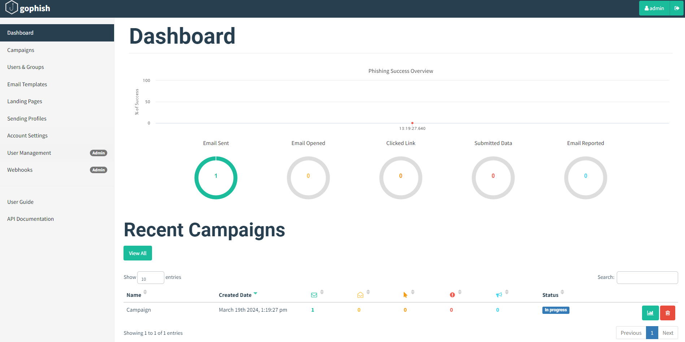

# Gophish Agent CI/CD pipeline

Deploy Gophish with CI/CD on Elestio

 
 

# When deploying ...

You can open Gophish UI here:

    URL: https://[CI_CD_DOMAIN]
    Login: admin
    password: [ADMIN_PASSWORD]

You can access Phishing server at https://[CI_CD_DOMAIN]:8080/

# Custom domain instructions (IMPORTANT)

By default, we set up a CNAME on elestio.app domain, but you will probably want to have your domain.

***Step 1:*** Add your domain in the Elestio dashboard as explained here:

    https://docs.elest.io/books/security/page/custom-domain-and-automated-encryption-ssltls

***Step 2:*** Modify the environment variables and config.json file to set up your custom domain. Navigate to the Elestio dashboard, then proceed to Service Overview > Tools > Launch VS Code. Within the `.env` file, adjust the `DOMAIN` key to reflect your domain. Next, locate the `config.json` file in the data directory and include your domain in the `trusted_origins` array.

***Step 3:*** Open the VS code terminal and run the below command:
      
      docker-compose down;
      docker-compose up -d;
      

# Sending Profile

The Sending Profile feature enables you to configure SMTP settings for sending email campaigns. Here is a step-by-step guide on how to set up your SMTP configuration within the application.

1.  **Access Sending Profiles:** Navigate to the `Sending Profiles` section within the application.

2.  **Open Configuration Popup:** Upon entering the Sending Profiles section, a new popup window will appear, allowing you to configure your SMTP settings.

3.  **Configure SMTP Settings:** You have the option to use either your own SMTP credentials or the provided credentials for sending emails. Below are the details for both options:

    - **Using Your Own SMTP Credentials:** Input the appropriate information in the fields provided.

4.  **Save Changes:** After configuring your SMTP settings, ensure to save the changes before exiting the configuration popup.
